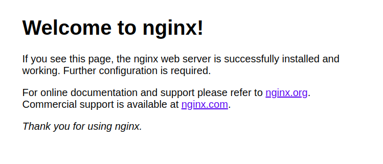
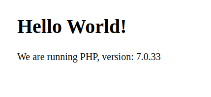

https://www.atlantic.net/vps-hosting/how-to-deploy-a-php-application-with-nginx-and-mysql-using-docker-and-docker-compose/

# Estructrura del directori

~/docker-project/
  ├── docker-compose.yml
  ├── nginx
  │   ├── default.conf
  │   └── Dockerfile
  ├── php
  │   └── Dockerfile
  └── www
      └── html
          └── index.php


# Crear el contenidor de Nginx

```bash
joan@ubuntu-docker:~ mkdir ~/docker-project

joan@ubuntu-docker:~ cd ~/docker-project
```


```bash
joan@ubuntu-docker:~/docker-project$ vi docker-compose.yml
```

Contingut del fitxer ```docker-compose.yml```
> nginx:
>    image: nginx:latest
>    container_name: nginx-container
>    ports:
>     - 80:80

```bash
joan@ubuntu-docker:~/docker-project$ sudo docker-compose up -d
Creating nginx-container ... done

joan@ubuntu-docker:~/docker-project$ sudo docker ps 
CONTAINER ID   IMAGE          COMMAND                  CREATED              STATUS          PORTS                               NAMES
e94f561843c2   nginx:latest   "/docker-entrypoint.…"   About a minute ago   Up 17 seconds   0.0.0.0:80->80/tcp, :::80->80/tcp   nginx-container
```

Open your web browser and access the URL http://your-server-ip. You should see the following page:



# Crear el contenidor de PHP

```bash
joan@ubuntu-docker:~ mkdir -p ~/docker-project/www/html

joan@ubuntu-docker:~/docker-project$ vi ~/docker-project/www/html/index.php
```

Contingut del fitxer ```~/docker-project/www/html/index.php```
> <!DOCTYPE html>  
>     <head>  
>     <title>Hello World!</title>
>     </head>  
> 
>     <body>  
>     <h1>Hello World!</h1>
>     <p><?php echo 'We are running PHP, version: ' . phpversion(); ?></p>
>     </body>

```bash
joan@ubuntu-docker:~ mkdir ~/docker-project/nginx

joan@ubuntu-docker:~$ vi ~/docker-project/nginx/default.conf
```

Contingut del fitxer ```~/docker-project/nginx/default.conf```
>     server {  
> 
>         listen 80 default_server;  
>         root /var/www/html;  
>         index index.html index.php;  
>    
>         charset utf-8;  
>    
>         location / {  
>          try_files $uri $uri/ /index.php?$query_string;  
>         }  
>    
>         location = /favicon.ico { access_log off; log_not_found off; }  
>         location = /robots.txt { access_log off; log_not_found off; }  
>    
>         access_log off;  
>         error_log /var/log/nginx/error.log error;  
>    
>         sendfile off;  
>    
>         client_max_body_size 100m;  
>    
>         location ~ .php$ {  
>          fastcgi_split_path_info ^(.+.php)(/.+)$;  
>          fastcgi_pass php:9000;  
>          fastcgi_index index.php;  
>          include fastcgi_params;  
>          fastcgi_param SCRIPT_FILENAME $document_root$fastcgi_script_name;  
>          fastcgi_intercept_errors off;  
>          fastcgi_buffer_size 16k;  
>          fastcgi_buffers 4 16k;  
>        }  
>    
>         location ~ /.ht {  
>          deny all;  
>         }  
>        } 

```bash
joan@ubuntu-docker:~$ vi ~/docker-project/nginx/Dockerfile
```

Contingut del fitxer ```~/docker-project/nginx/Dockerfile```
> FROM nginx:latest   
> COPY ./default.conf /etc/nginx/conf.d/default.conf


Contingut del fitxer ```~/docker-project/docker-compose.yml```

> nginx:
>   build: ./nginx/
>   container_name: nginx-container
>   ports:
>     - 80:80
>   links:
>     - php
>   volumes:
>     - ./www/html/:/var/www/html/
> 
> php:
>   image: php:7.0-fpm
>   container_name: php-container
>   expose:
>     - 9000
>   volumes:
>     - ./www/html/:/var/www/html/


```bash
joan@ubuntu-docker:~$ cd ~/docker-project

joan@ubuntu-docker:~/docker-project$ sudo docker-compose up -d
```

Open your web browser and access the URL http://your-server-ip. You should see the following page:



```bash
joan@ubuntu-docker:~$ vi ~/docker-project/www/html/index.php
```

Contingut del fitxer ```~/docker-project/www/html/index.php```

> <!DOCTYPE html>  
> <head>  
> <title>Hello World!</title>
> </head>  
> 
> <body>  
> <h1>Hello World! Changes are Applied</h1>
> <p><?php echo 'We are running PHP, version: ' . phpversion(); ?></p>
> </body>

Open your web browser and access the URL http://your-server-ip. You should see the following page:


# Crear el contenidor de Dades

```bash
joan@ubuntu-docker:~$ vi ~/docker-project/docker-compose.yml
```

Contingut del fitxer ```~/docker-project/nginx/Dockerfile```

nginx:
  build: ./nginx/
  container_name: nginx-container  
  ports:
    - 80:80
  links:
    - php
  volumes_from:
    - app-data

php:
  image: php:7.0-fpm
  container_name: php-container
  expose:
    - 9000
  volumes_from:
    - app-data

app-data:
  image: php:7.0-fpm
  container_name: app-data-container
  volumes:
    - ./www/html/:/var/www/html/
  command: "true"


```bash
joan@ubuntu-docker:~$ cd ~/docker-project

joan@ubuntu-docker:~/docker-project$ sudo docker-compose up -d
Creating app-data-container ... done
Recreating php-container    ... done
Recreating nginx-container  ... done
```

```bash
joan@ubuntu-docker:~/docker-project$ sudo docker ps -a
CONTAINER ID   IMAGE                  COMMAND                  CREATED         STATUS                      PORTS                               NAMES
fb5a3105591a   docker-project_nginx   "/docker-entrypoint.…"   3 minutes ago   Up 3 minutes                0.0.0.0:80->80/tcp, :::80->80/tcp   nginx-container
9cdc9120219d   php:7.0-fpm            "docker-php-entrypoi…"   3 minutes ago   Up 3 minutes                9000/tcp                            php-container
25ea417f57b0   php:7.0-fpm            "docker-php-entrypoi…"   3 minutes ago   Exited (0) 35 seconds ago                                       app-data-container
```


# Crear el contenidor de MySQL 

```bash
joan@ubuntu-docker:~$ mkdir ~/docker-project/php

joan@ubuntu-docker:~$ sudo vi ~/docker-project/php/Dockerfile
```

Contingut del fitxer ```~/docker-project/php/Dockerfile```

FROM php:7.0-fpm  
RUN docker-php-ext-install pdo_mysql 


```bash
joan@ubuntu-docker:~$ sudo vi ~/docker-project/docker-compose.yml
```

Contingut del fitxer ```~/docker-project/docker-compose.yml```

nginx:
  build: ./nginx/
  container_name: nginx-container
  ports:
  - 80:80
  links:
  - php
  volumes_from:
  - app-data

php:
  build: ./php/
  container_name: php-container
  expose:
    - 9000
  links:
    - mysql
  volumes_from:
    - app-data

app-data:
  image: php:7.0-fpm
  container_name: app-data-container
  volumes:
    - ./www/html/:/var/www/html/
  command: "true"

mysql:
  image: mysql:5.7
  container_name: mysql-container
  volumes_from:
    - mysql-data
  environment:
    MYSQL_ROOT_PASSWORD: secret
    MYSQL_DATABASE: mydb
    MYSQL_USER: myuser
    MYSQL_PASSWORD: password

mysql-data:
  image: mysql:5.7
  container_name: mysql-data-container
  volumes:
    - /var/lib/mysql
  command: "true"

```bash
joan@ubuntu-docker:~$ sudo vi ~/docker-project/www/html/index.php
```
  
<!DOCTYPE html>

<head>
    <title>Hello World!</title>
</head>

<body>
    <h1>Hello World!</h1>
    <p>
        <?php echo 'We are running PHP, version: ' . phpversion(); ?>
    </p>
    <?  
       $database ="mydb";  
       $user = "myuser";  
       $password = "password";  
       $host = "mysql";  

       $connection = new PDO("mysql:host={$host};dbname={$database};charset=utf8", $user, $password);  
       $query = $connection->query("SELECT TABLE_NAME FROM information_schema.TABLES WHERE TABLE_TYPE='BASE TABLE'");  
       $tables = $query->fetchAll(PDO::FETCH_COLUMN);  

        if (empty($tables)) {
          echo "<p>There are no tables in database \"{$database}\".</p>";
        } else {
          echo "<p>Database \"{$database}\" has the following tables:</p>";
          echo "<ul>";
            foreach ($tables as $table) {
              echo "<li>{$table}</li>";
            }
          echo "</ul>";
        }
        ?>
</body>

</html>


```bash
joan@ubuntu-docker:~ cd ~/docker-project

joan@ubuntu-docker:~/docker-project$ sudo docker-compose up -d
Creating mysql-data-container ... done
Creating app-data-container   ... done
Creating mysql-container      ... done
Creating php-container        ... done
Creating nginx-container      ... done

joan@ubuntu-docker:~/docker-project$ 
```


```bash
joan@ubuntu-docker:~/docker-project$ sudo docker ps -a

```